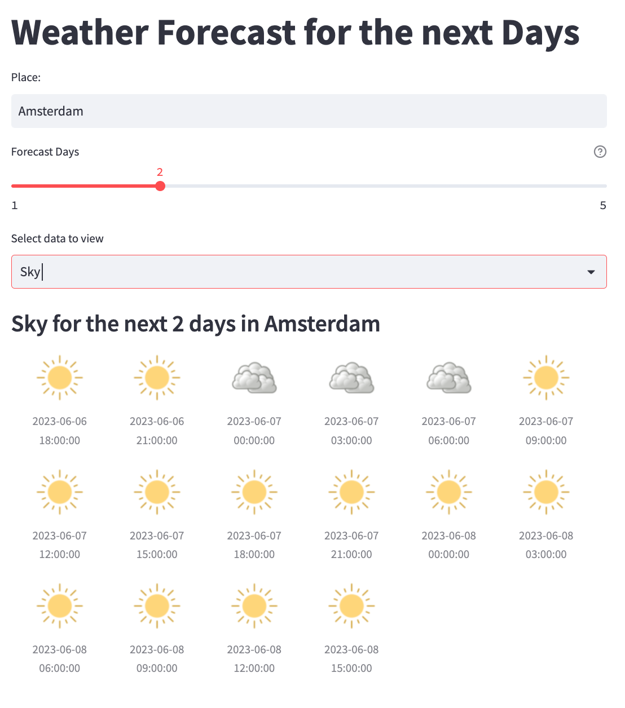

# Weather Forecast Web App

### What is this web app?
This is a weather forecast web app created with Python 3.11.

### How to run this app?

#### Option 1: Run it online

[Weather Forecast Web App](https://psestic-python-weather-forecast-web-app-main-es8hec.streamlit.app/)

#### Option 2: Run it locally

- Clone this repository
- Register at [OpenWeatherMap](https://openweathermap.org/) and get an API Key
- Open the file "get_data.py"
- Replace line 4   
                "API_KEY = os.getenv("APIKEY")" with 
                "API_KEY = <your_api_key>"
- Install streamlit and plotly
- Run streamlit run main.py in the terminal

### Technology used for this project
- Python (streamlit, plotly, requests, os)
- OpenWeatherMap API (https://openweathermap.org/)